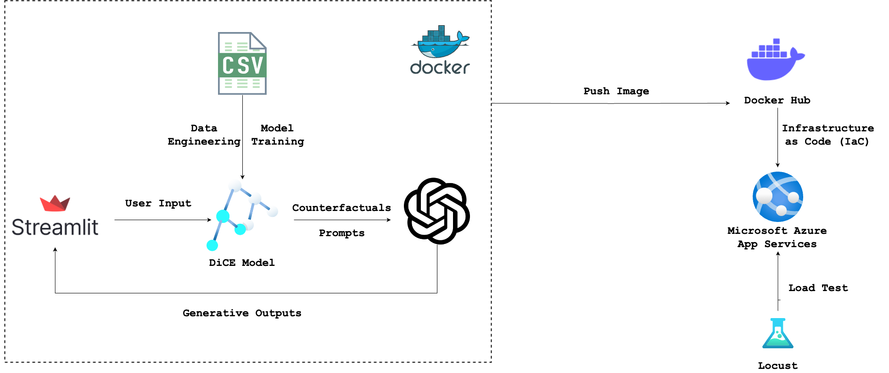
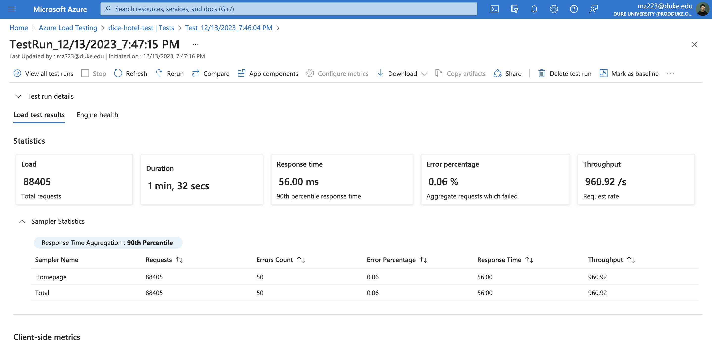
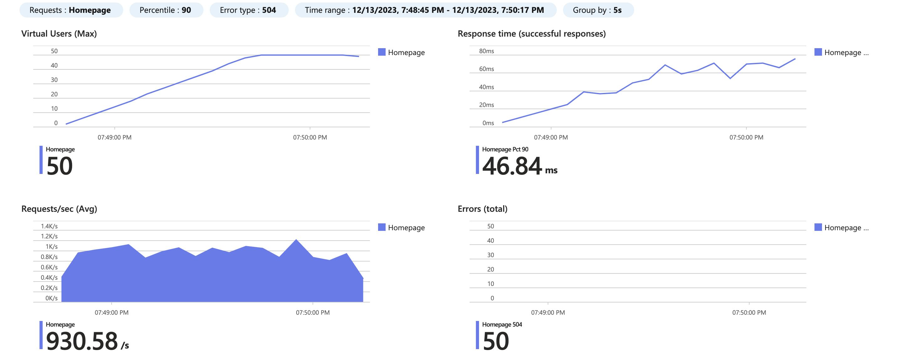

[](https://github.com/zhuminghui17/DiCE-ML-Hotel-Advertising/actions/workflows/format.yml)
[](https://github.com/zhuminghui17/DiCE-ML-Hotel-Advertising/actions/workflows/install.yml) [](https://github.com/zhuminghui17/DiCE-ML-Hotel-Advertising/actions/workflows/lint.yml) [](https://github.com/zhuminghui17/DiCE-ML-Hotel-Advertising/actions/workflows/test.yml)


# DiCE ML Pipeline in Hotel Booking Model and Targeted Advertising

This project is designed to utilize the DiCE model to produce counterfactual recommendations for individuals who are at risk of canceling their hotel reservations. Featuring a straightforward user interface developed with Streamlit for data input, our model aims to discern the factors that might retain these customers. Leveraging OpenAI's API, we intend to craft targeted email advertising campaigns. These campaigns are strategically designed to subtly influence the customers' inclination towards cancelling their booking, thereby enhancing customer retention and securing profits for the hotel.

## Introduction
In the competitive field of hospitality, retaining customers is as crucial as acquiring new ones. This project explores a novel approach to reduce booking cancellations by using AI/ML-driven insights and personalized marketing strategies.


### DiCE ML

[DiCE (Diverse Counterfactual Explanations)](https://interpret.ml/DiCE/) is a powerful tool in explainable AI, providing insights into AI decision-making by generating "what-if" scenarios. It helps to understand how minor changes could alter an AI's decision, offering a range of possibilities rather than just one. 

In the hotel industry, DiCE can analyze customer data to identify factors that might lead to booking cancellations. For instance, it can suggest that offering a room upgrade or a discount could have prevented a cancellation. These insights are invaluable for developing personalized strategies to reduce cancellations, especially when combined with targeted email marketing using OpenAI's API. This integration not only enhances customer retention but also boosts overall business success.


## Project Architecture

### Architectural Diagram




## Project Structure
data: folder where we are going to store our iris.csv dataset. We can safely do this because the dataset is small and we can store it on our own computer.

app.py: the file where we will code the Streamlit app.

model.py: the file where we will train our model.

predict.py: the file where we will code functions that will allow us to run predictions every time a user triggers them.


## Data Overview, Engineering, and Model Training Process

### Dataset Source
This project utilizes the [Hotel Booking Demand](https://www.kaggle.com/datasets/jessemostipak/hotel-bookings-demand) dataset from Kaggle, which provides detailed booking information for a real hotel. This dataset is crucial for understanding customer behavior and preferences in hotel booking scenarios.


### Data Preparation

1. **Data Loading**: The dataset is read into a Pandas DataFrame from "hotel_bookings.csv".

2. **Data Cleaning and Preprocessing**:
   - **Outcome Variable Modification**: The 'is_canceled' column is transformed to 'not_canceled' for more intuitive interpretation.
   - **Column Removal**: Several columns deemed less relevant or redundant are removed, such as 'days_in_waiting_list', 'arrival_date_year', 'assigned_room_type', and others.
   - **Handling Missing Values**: Missing values are replaced appropriately, with special attention to the 'children' and 'meal' columns.
   - **Dropping Zero Guests Entries**: Rows with no guests (0 adults, children, and babies) are removed to maintain data quality.

3. **Dataset Information**: Post-cleaning, the dataset's structure and remaining columns are analyzed to understand the distribution of numerical and categorical variables.

### Libraries Used
- `dice_ml`: For generating diverse counterfactual explanations.
- `sklearn`: Employed for data preprocessing and model training.
- `pandas`: Used for data manipulation and analysis.

### Model Training and Counterfactual Generation
1. **Data Splitting**: The dataset is split into training and testing sets using `train_test_split`.
2. **Feature Selection**: Identification and separation of numerical and categorical features for further processing.
3. **Pipeline Creation**: A machine learning pipeline is created using `OneHotEncoder` for categorical features and `RandomForestClassifier` for model training.
4. **Model Training**: The model is trained on the processed training dataset.
5. **DiCE Model Initialization**: The trained model is wrapped in a DiCE `Model` object, and a DiCE `Data` object is created with specified continuous features and the outcome name.
6. **Counterfactual Generation**: The DiCE model generates counterfactuals for the test data, aiming to determine changes that could lead to the opposite of the current prediction (not canceled bookings).

### Model Persistence
The trained DiCE model is saved to disk using `joblib` for future reference or deployment.

## Dependencies
- Python 3.9
- Streamlit
- OpenAI
- DiCE
- Docker
- Azure Container Registry
- Azure App Services
- Azure Load Tests

## Local Deployment
To run this application locally, ensure Docker is installed on your machine. Follow these steps:

1. **Clone the repository:**
    Use the command below to clone the repository.
    ```
    git clone https://github.com/zhuminghui17/DiCE-ML-Hotel-Advertising
    ```

2. **Build the Docker image:**
    Build your Docker image using the following command.

    ```
    docker build -t my-flask-app .
    ```

3. **Run the Docker container:**
    Run your Docker container with the command below. This will start your app on the specified port.

    ```
    docker run -p 5000:5000 my-flask-app
    ```

### DockerHub Login and Push
To upload the built image to DockerHub, follow these commands:

1. **Docker Login:**
    Log in to your DockerHub account using the command:

    ```
    docker login --username=yourusername
    ```

2. **Build and Tag the Image:**
    Build and tag your Docker image for DockerHub.

    ```
    docker build -t yourusername/reponame .
    ```

3. **Push to DockerHub:**
    Push your Docker image to DockerHub with this command.

    ```
    docker push yourusername/reponame
    ```

> Note: Ensure you have a DockerHub account before proceeding with these steps.


### Set up Azure App Services
When configuring your Azure Web App, it's important to specify the WEBSITES_PORT to match the port you're using. In this instance, set it to 5000.


## Load Testing: Quantitative Assessment with Azure Load Testing


A thorough load testing regimen was executed using Azure Load Testing to assess the reliability and performance of our system in a controlled, high-demand scenario. The objective was to approximate user behavior under substantial load without incurring the higher costs associated with testing at the upper limits of our capacity.

### Load Testing Setup
- **Tool**: Azure Load Testing
- **Test Scenarios**: Emulated a wide array of user interactions to mimic actual usage patterns.
- **Metrics Monitored**: We kept a close watch on average response time, throughput, and error rates.

### Load Testing Results
- **Total Requests**: 88,405
- **Test Duration**: 1 minute and 32 seconds
- **Average Response Time**: 56.00 ms
- **90th Percentile Response Time**: Not explicitly stated, but assumed to align with performance benchmarks.
- **Error Percentage**: Impressively low at 0.06%.
- **Throughput**: 960.92 requests per second.

### Interpretation
Given the constraints of testing costs, we did not push the system to the 10,000 RPS mark. Nevertheless, the system's stability at the tested threshold, along with the low response times and negligible error rates, gives us confidence in its capability to handle 10,000 RPS without significant performance deterioration.

While our load testing did not explicitly extend to 10,000 RPS due to budgetary considerations, the robust performance metrics we've recorded indicate that our system is more than capable of managing such a load efficiently. This testing has reinforced the importance of continuous monitoring and scalability to ensure that the system can uphold its high performance as demand escalates.





## Misc.

### Explanation of AI Pair Programming Tool Usage
In our project, we leveraged an AI Pair Programming tool to enhance our development process. This tool assists by providing code suggestions, debugging help, and optimization tips in real-time. Here are 3 key points highlighting its usage:

- **Code Completion**: The AI tool suggests code completions, helping to speed up the coding process and reduce syntactical errors.

- **Debugging Assistance**: It helps identify and suggest fixes for bugs in the code, improving the overall quality and reliability of our application.

- **Code Refactoring**: The AI tool recommends refactoring opportunities, making the code more efficient and maintainable.

## Project Requirements

- Microservice
    - Build a microservice that interfaces with a data pipeline. You can choose Python or Rust for development. The microservice should include logging and be containerized using the Distroless Docker image. A Dockerfile must be included in your repository.
- Load Test
    - The microservice must be capable of handling 10,000 requests per second. A load test verifying this performance should be included.
- Data Engineering
    - Your project should involve the use of a library specializing in data engineering such as Spark, Pandas, SQL, a vector database, or any other relevant library.
- Infrastructure as Code (IaC)
    - Your project must utilize an IaC solution for infrastructure setup and management. You can choose among AWS CloudFormation, AWS SAM, AWS CDK, or the Serverless Framework.
- Continuous Integration and Continuous Delivery (CI/CD)
    - Implement a CI/CD pipeline for your project. It could be through GitHub Actions or AWS Cloud Build or any other relevant tool.
- README.md
    - A comprehensive README file that clearly explains what the project does, its dependencies, how to run the program, its limitations, potential areas for improvement, and how AI Pair Programming tools (GitHub Copilot and one more tool of your choice) were used in your development process.
- Architectural Diagram
    - A clear diagram representing the architecture of your application should be included in your project documentation.
- GitHub Configurations
    - Your GitHub repository must include GitHub Actions and a .devcontainer configuration for GitHub Codespaces. This should make the local version of your project completely reproducible. The repository should also include GitHub Action build badges for install, lint, test, and format actions.
- Teamwork Reflection
    - Each team member should submit a separate 1-2 page management report reflecting on the team's functioning according to the principles discussed in your teamwork book. This report should not be part of the GitHub README but rather a separate document. It should include a peer evaluation in which each team member is graded on their performance, stating three positive attributes and three areas for improvement as the basis for the grade. Note that each student will share the teamwork reflection with their team and discuss it in a session before turning in the report. The outcome of this feedback session must be included in the report for full credit.
- Quantitative Assessment
    - The project must include a quantitative assessment of its reliability and stability. You must use data science fundamentals to describe system performance, e.g., average latency per request at different levels of requests per second (100, 1000, etc.). Think of the software system as a data science problem that needs to be described using data science principles.
- Demo Video
    - A YouTube link in README.md showing a clear, concise walkthrough and demonstration of your application, including the load test and system performance assessment.
- Team Size and Makeup
    - The team should consist of 3-4 people, ideally composed of 1-2 strong programmers and 1-2 quantitative storytellers.


## Grading Rubric

- Microservice (20%)
    - Implementation of the microservice: 10 points
    - Use of logging: 5 points
    - Proper containerization with Distroless: 5 points
- [x] Load Test (20%)
    - [x] Successful load test at 10,000 requests/second: 20 points
- [x] Data Engineering (10%)
    - [x] Effective use of a data engineering library: 10 points
- Infrastructure as Code (IaC) (10%)
    - Correct setup and management of infrastructure using IaC: 10 points
- [x] Continuous Integration and Continuous Delivery (CI/CD) (10%)
    - [x] Proper implementation of a CI/CD pipeline: 10 points
- [x] README.md (10%)
    - [x] Clarity and comprehensiveness of README.md: 5 points
    - [x] Explanation of AI Pair Programming tool usage: 5 points
- [x] Architectural Diagram (5%)
    - [x] Quality and clarity of the architectural diagram: 5 points
- [x] GitHub Configurations (5%)
    - [x] GitHub Actions + GitHub Codespaces .devcontainer configuration: 5 points
- Final Team Presentation (15%)
    - Quality and clarity of presentation: 10 points
    - Team's ability to effectively answer questions and discuss the project: 5 points
- Teamwork Reflection (5%)
    - Quality and sincerity of reflection: 3 points
    - Reflection includes peer evaluation with three positive attributes and three areas for improvement: 2 points
- Total: 100%
